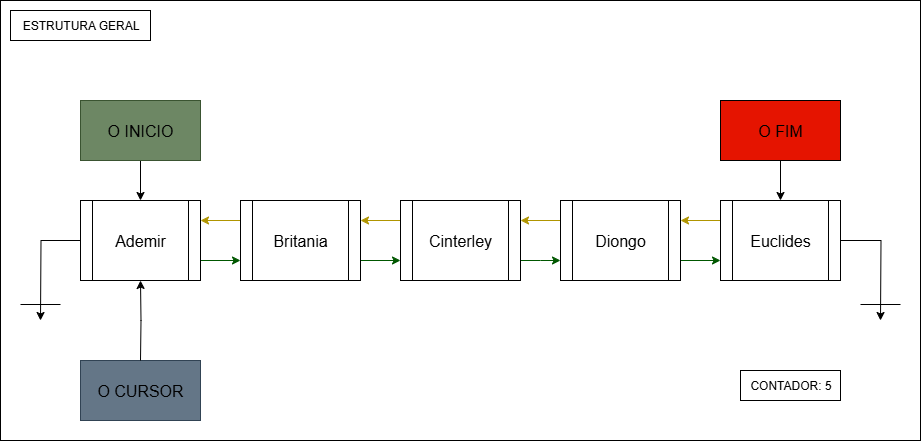
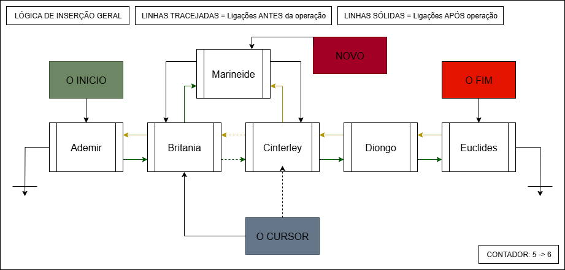
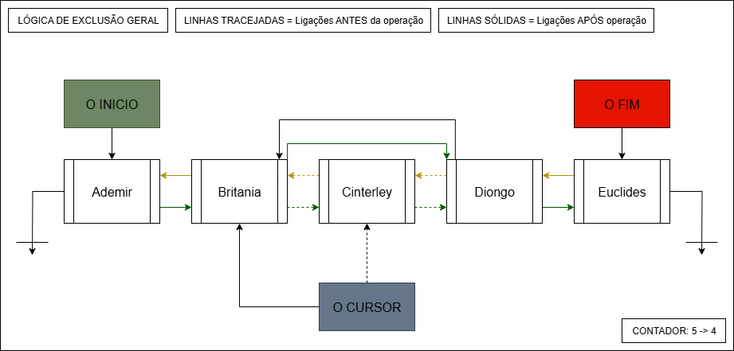

# Implementação de Lista Duplamente Encadeada em Python

Este projeto apresenta uma implementação completa e robusta da estrutura de dados de Lista Duplamente Encadeada, desenvolvida em Python. O objetivo foi criar uma classe `Lista` funcional, eficiente e com uma interface bem definida, utilizando um cursor para manipulação avançada dos elementos.

## 1. Estrutura de Dados

A implementação é baseada em duas classes: `Elemento`, que representa o individual, e `Lista`, que manipulas todos os elementos.

### A Classe `Elemento`
A classe `Elemento` é a unidade fundamental da lista. Cada objeto armazena três informações vitais:
* **`__elemento`**: O dado útil (a "chave identificadora").
* **`__prox`**: Um ponteiro para o próximo `Elemento` na sequência.
* **`__ant`**: Um ponteiro para o `Elemento` anterior na sequência.

### A Classe `Lista`
A classe `Lista` gerencia a estrutura como um todo, utilizando quatro atributos principais para garantir eficiência e funcionalidade:

* **`__inicio` e `__fim`**: Manter ponteiros para o primeiro e o último elemento permite que inserções e exclusões nas extremidades da lista sejam executadas em tempo constante **O(1)**.
* **`__cursor`**: Funciona como um "ponteiro de trabalho" ou um marcador de posição. É o elemento central para operações no meio da lista, como `InserirAntesDoAtual`, `ExcluirAtual` e a `busca`.
* **`__tamanho`**: Um contador que armazena o número de elementos. Isso permite que a verificação do tamanho da lista seja uma operação de tempo constante **O(1)**, uma otimização crucial em relação à alternativa de percorrer a lista a cada chamada.



## 2. Lógicas Principais

A classe foi projetada considerando um **"cursor ativo"**, onde a maioria das operações de modificação (inserção/exclusão) move o cursor para o local da ação, tornando o comportamento da classe consistente e previsível.

### Lógica de Inserção

A inserção de um novo elemento no meio da lista segue um processo de dois passos para garantir que a integridade da lista seja mantida:

1.  **"Pendurar" o Novo Elemento**: O novo elemento é conectado aos seus futuros vizinhos. Seu ponteiro `prox` aponta para o elemento atual (`cursor`) e seu ponteiro `ant` aponta para o vizinho anterior do cursor.
2.  **"Formalizar" a Conexão**: Os vizinhos são atualizados para reconhecer o novo elemento. O ponteiro `prox` do vizinho anterior e o ponteiro `ant` do vizinho seguinte são redirecionados para o novo elemento.

**Comportamento do Cursor:** Ao final de uma operação de inserção, o cursor sempre apontará para o **novo elemento inserido**.



#### Métodos de Inserção:
* `inserirComoPrimeiro(novo)`: Adiciona um elemento no início da lista.
* `inserirComoUltimo(novo)`: Adiciona um elemento no final da lista.
* `InserirAntesDoAtual(novo)`: Insere um elemento antes da posição do cursor.
* `InserirApósAtual(novo)`: Insere um elemento após a posição do cursor.
* `inserirNaPosicao(k, novo)`: Insere um elemento na posição `k`, utilizando uma otimização que escolhe o caminho mais curto (a partir do início ou do fim).

### Lógica de Exclusão

A exclusão de um elemento consiste em fazer com que seus vizinhos (anterior e próximo) "se enxerguem", ignorando o elemento a ser removido. Os ponteiros `prox` do elemento anterior e `ant` do elemento posterior são redirecionados um para o outro, efetivamente removendo todas as referências ao elemento excluído e permitindo que ele seja liberado pela memória.

**Comportamento do Cursor:** Ao final de uma operação de exclusão, o cursor apontará para o elemento **anterior ao removido** (ou para o novo início/fim, conforme o caso).



#### Métodos de Exclusão:
* `ExcluirPrim()`: Remove o primeiro elemento.
* `ExcluirUlt()`: Remove o último elemento.
* `ExcluirAtual()`: Remove o elemento atualmente apontado pelo cursor.

### Busca e Acesso
* `Buscar(chave)`: Procura por um elemento com a `chave` especificada. Se encontrar, posiciona o cursor sobre ele e retorna `True`. Caso contrário, move o cursor para o início da lista e retorna `False`.
* `acessarAtual()`: Retorna o valor do elemento onde o cursor está posicionado. Retorna `None` se o cursor não estiver posicionado.

## 3. Exemplo de Uso

```python
# Instanciando e populando a lista
minha_lista = Lista()
minha_lista.inserirComoPrimeiro(20)
minha_lista.inserirComoPrimeiro(10)
minha_lista.inserirComoUltimo(30)
# Lista: [ 10 | 20 | 30 | ]

# Inserindo na posição 2
minha_lista.inserirNaPosicao(2, 99)
minha_lista.mostra_lista()
# Saída: | 10 | 20 | 99 | 30 | 
print(f"Cursor está em: {minha_lista.acessarAtual()}") # Saída: Cursor está em: 99

# Buscando um elemento
encontrou = minha_lista.Buscar(20)
print(f"Encontrou o elemento 20? {encontrou}") # Saída: True
print(f"Cursor agora está em: {minha_lista.acessarAtual()}") # Saída: Cursor está em: 20

# Removendo o elemento atual (20)
minha_lista.ExcluirAtual()
minha_lista.mostra_lista()
# Saída: | 10 | 99 | 30 | 
print(f"Cursor foi para o anterior: {minha_lista.acessarAtual()}") # Saída: Cursor foi para o anterior: 10
